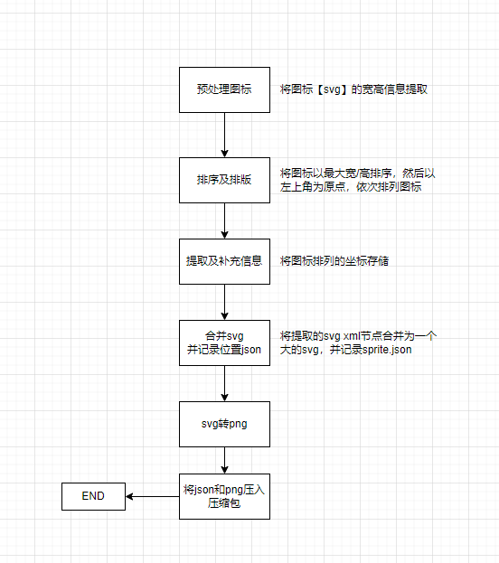
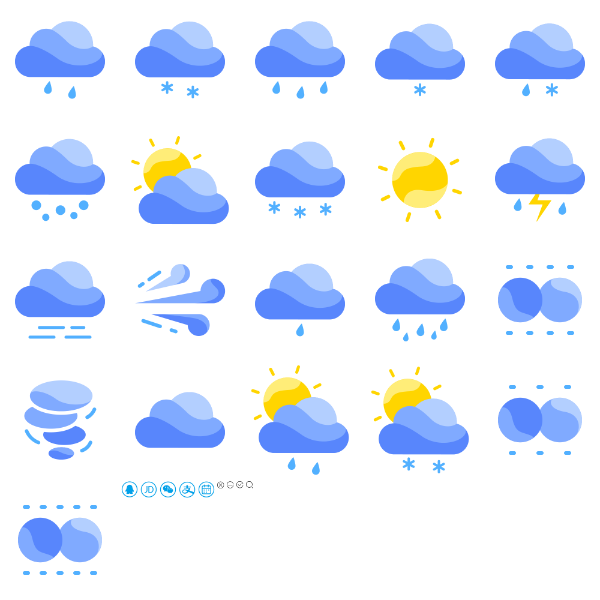

# svg-sprite
svg-sprite-java
将图标（即svg）合并为雪碧图。

## 引用：

其中排版算法、引用冲突参考[svg-sprite](https://github.com/svg-sprite/svg-sprite)

## 工作流程

将svg合并成一个整体svg， 并处理样式及引用冲突。然后使用apache的batik将svg转换为png



## 使用示例

``` java
SVGTranscoder svgTranscoder = new SVGTranscoder();
List<File> list = Files.list(Paths.get("example/icon"))
    .filter(path -> path.getFileName().toString().endsWith(".svg"))
    .map(Path::toFile)
    .collect(Collectors.toList());
// byte[] is zip file
// byte[] transcoder = svgTranscoder.transcoder(list, new int[]{1, 2});
// IOUtils.write(transcoder, Files.newOutputStream(Paths.get("example/sprite/sprite.zip")));
// or generate sprite target directory
svgTranscoder.transcoder(Paths.get("D:\\Document\\\\test"), list, new int[]{1, 2});
```

### 结果示例




use:

```html
<html>
<div id="sprite1">
</div>
<div id="sprite2">
</div>
<style>
#sprite1 {
	width: 200px;
	height: 200px;
	 background-position: -200px -200px;
	background-image: url("./sprite.png");
}
#sprite2 {
	width: 32px;
	height: 32px;
	 background-position: -784px -1600px;
	background-image: url("./sprite@2x.png");
}
</style>
</html>
```


